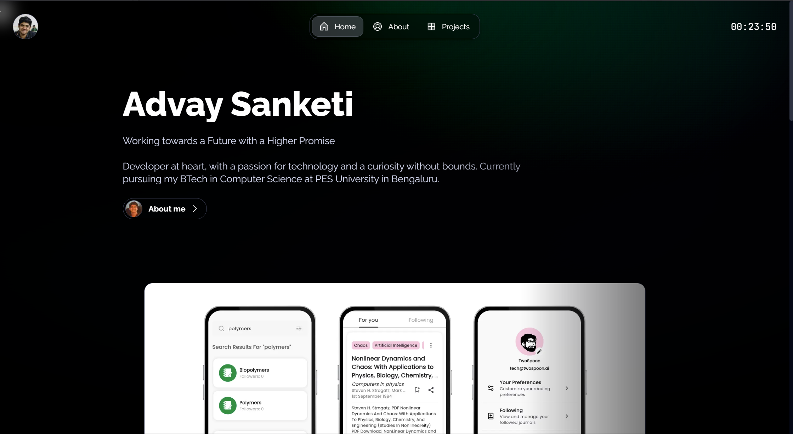
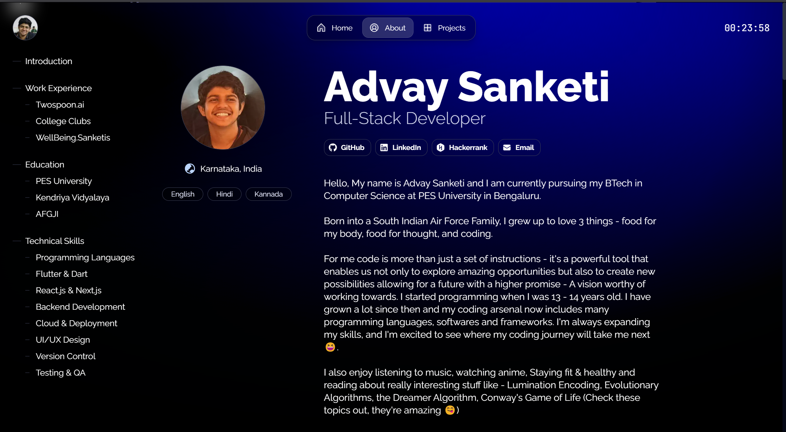
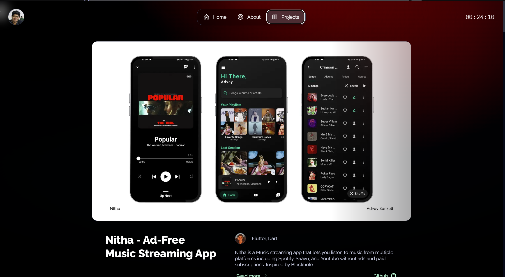

# 🚀 Advay Sanketi - Portfolio

Welcome to my **portfolio website**, where I showcase my **projects, skills, and experience** as a **Full Stack Developer**.

🌟 **Tech Stack**:  
✔ Full Stack Development (Web & Mobile)  
✔ Backend Systems & Databases  
✔ Machine Learning & AI Integration  
✔ UI/UX Design

📌 **Live Website**: [advay-sanketi-portfolio.vercel.app](https://advay-sanketi-portfolio.vercel.app/)

---

## 🎨 Preview

| Page Name         | Screenshot                                |
| ----------------- | ----------------------------------------- |
| **Home Page**     |       |
| **About Page**    |  |
| **Projects Page** |  |

---

## 🔍 Project Details & Deep Dive

My portfolio features a **detailed breakdown** of each project, including:

📌 **Overview** – What the project does and its purpose  
🛠 **Tech Stack** – The technologies used to build it  
🎨 **Screenshots** – Visual previews of the project in action

🚀 **Deep Dive Section**  
For those interested in the **architecture and tech details**, each project also includes a **Deep Dive** section that explores:

- System design & structure
- Database schema & API flow
- Performance optimizations & scalability
- Technical challenges & solutions

Make sure to check it out!

---

## 📦 Installation & Setup

Follow these steps to set up the project locally:

### 1️⃣ Clone the Repository

```sh
git clone https://github.com/AdvaySanketi/portfolio.git
cd portfolio
```

### 2️⃣ Install Dependencies

```sh
npm install
```

### 3️⃣ Run the Development Server

```sh
npm run dev
```

Now, open **[http://localhost:3000](http://localhost:3000/)** in your browser! 🚀

---

## 🚀 Deployment

For a production build:

```sh
npm run build
```

To preview the production build locally:

```sh
npm run start
```

---

## 📜 License

Distributed under the MIT License. See [LICENSE](LICENSE) for more information.

---

## 🔗 Connect with Me

📧 **Email**: [advay2807@gmail.com](mailto:advay2807@gmail.com)  
💼 **Portfolio**: [advay-sanketi-portfolio.vercel.app](https://advay-sanketi-portfolio.vercel.app/)  
🐙 **GitHub**: [github.com/AdvaySanketi](https://github.com/AdvaySanketi)  
💬 **LinkedIn**: [linkedin.com/in/advaysanketi](https://www.linkedin.com/in/advaysanketi/)

---

🔥 _Built with passion & creativity!_ 🚀
